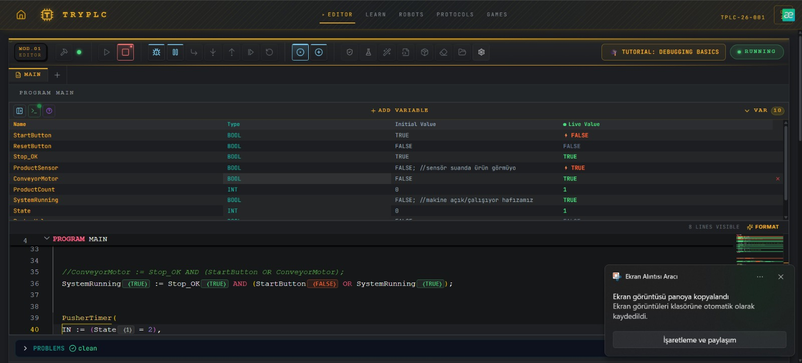
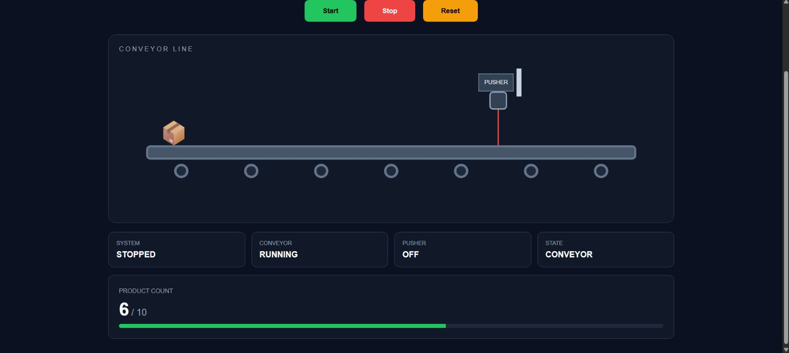
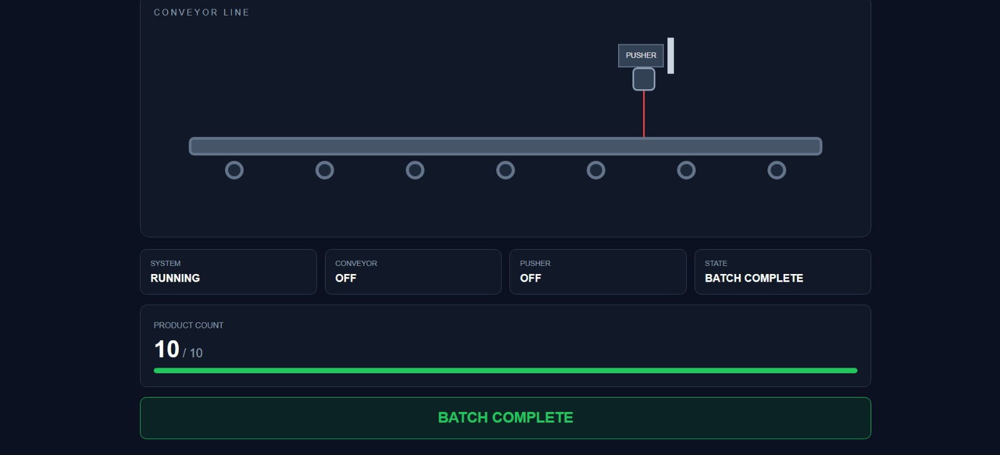

# PLC Conveyor Batch Control System

## 🇹🇷 Türkçe

### Proje Hakkında

Bu proje, temel PLC programlama ve endüstriyel otomasyon kavramlarını uygulamak amacıyla geliştirilmiş bir **konveyör batch kontrol sistemi simülasyonudur**.

PLC kontrol algoritması, **IEC 61131-3 Structured Text (ST)** dili kullanılarak geliştirilmiştir. Kodlama ve simülasyon işlemleri tarayıcı tabanlı **TryPLC** editörü üzerinde gerçekleştirilmiştir.

Fiziksel bir PLC veya konveyör sistemi kullanılmadığı için giriş değerleri TryPLC üzerinden simüle edilmiş, programın ürettiği durumlar ve çıkışlar canlı değişken değerleri üzerinden gözlemlenmiştir.

PLC kontrol mantığını görsel olarak göstermek amacıyla ayrıca **HTML, CSS ve JavaScript** kullanılarak web tabanlı bir konveyör simülasyonu hazırlanmıştır.

---

## Kullanılan Teknolojiler

### PLC / Otomasyon

- IEC 61131-3 Structured Text (ST)
- TryPLC Online PLC Editor & Simulator
- State Machine
- R_TRIG Rising Edge Detection
- TON Timer
- Start / Stop Latch Logic
- Product Counter
- Batch Control

### Web Görselleştirme

- HTML5
- CSS3
- JavaScript

---

## Sistem Mantığı

Sistem başlangıçta **IDLE** durumunda bekler.

START komutu verildiğinde sistem çalışmaya başlar ve konveyör aktif hale gelir. START sinyali bırakıldıktan sonra sistemin çalışmaya devam etmesi için latch/mühürleme mantığı kullanılmıştır.

Bir ürün sensöre ulaştığında ürünün gelişi `R_TRIG` ile rising edge olarak algılanır. Böylece sensör birden fazla PLC scan cycle boyunca TRUE durumda kalsa bile aynı ürün yalnızca bir kez sayılır.

Ürün algılandıktan sonra konveyör durur ve sistem **PUSHING** durumuna geçer. Pusher aktif hale gelir ve `TON` timer ile belirlenen süre boyunca çalışır.

Pusher işlemi tamamlandığında sistem ürün sayısını kontrol eder. Batch hedefi henüz tamamlanmadıysa tekrar konveyör durumuna dönülür ve yeni ürün beklenir.

Batch hedefi bu projede **10 ürün** olarak belirlenmiştir. 10. ürünün pusher işlemi tamamlandığında sistem **BATCH COMPLETE** durumuna geçer. Konveyör ve pusher durdurulur ve batch tamamlandı bilgisi aktif hale gelir.

RESET komutu ürün sayısını sıfırlar ve sistemi IDLE durumuna döndürür. RESET sonrasında yeni batch otomatik olarak başlamaz; tekrar START komutu verilmesi gerekir.

### Genel Akış

```text
IDLE
  │
  │ START
  ▼
CONVEYOR RUNNING
  │
  │ Product Detected
  ▼
PUSHING
  │
  │ Timer Completed
  ▼
Product Count Check
  │
  ├── Count < 10 ──────► CONVEYOR RUNNING
  │
  └── Count >= 10 ─────► BATCH COMPLETE
                               │
                               │ RESET
                               ▼
                              IDLE
```

---

## State Machine

Sistemin çalışma sekansı state tabanlı olarak kontrol edilmektedir.

| State | Durum          | Açıklama                              |
| ----: | -------------- | ------------------------------------- |
|   `0` | IDLE           | Sistem başlangıç/bekleme durumunda    |
|   `1` | CONVEYOR       | Konveyör çalışıyor ve ürün bekleniyor |
|   `2` | PUSHING        | Konveyör durmuş, pusher çalışıyor     |
|   `4` | BATCH COMPLETE | Batch hedefi tamamlandı               |

İlk 9 ürün için temel geçiş:

```text
STATE 1 → STATE 2 → STATE 1
```

10. ürün için:

```text
STATE 1 → STATE 2 → STATE 4
```

şeklindedir.

---

## Temel PLC Mantığı

### Start / Stop

Sistemin START butonu bırakıldıktan sonra da çalışmaya devam etmesi için latch mantığı kullanılmıştır.

```iecst
SystemRunning := Stop_OK AND (StartButton OR SystemRunning);
```

`Stop_OK` FALSE olduğunda çalışma hafızası kesilir ve sistem durur. Stop koşulu tekrar normale döndüğünde sistem otomatik başlamaz; yeniden START komutu gerekir.

### Ürün Algılama

Ürün sensörünün sürekli TRUE kalması durumunda aynı ürünün tekrar tekrar sayılmasını engellemek için `R_TRIG` kullanılmıştır.

```iecst
ProductEdge(CLK := ProductSensor);
```

Böylece ürün gelişi:

```text
FALSE → TRUE
```

geçişi üzerinden bir event olarak değerlendirilir.

### Pusher Zamanlaması

Pusher'ın belirlenen süre boyunca aktif kalması için `TON` timer kullanılmıştır.

```iecst
PusherTimer(
    IN := (State = 2),
    PT := T#500ms
);
```

Timer tamamlandıktan sonra ürün sayısı kontrol edilerek sistem tekrar konveyör durumuna veya Batch Complete durumuna geçirilir.

---

## Web Tabanlı Görselleştirme

PLC kontrol sekansını daha anlaşılır şekilde göstermek amacıyla ayrıca web tabanlı bir görselleştirme hazırlanmıştır.

**HTML**, arayüzdeki conveyor, product, sensor, pusher, START/STOP/RESET butonları ve durum göstergelerinin yapısını oluşturur.

**CSS**, kontrol panelinin tasarımını, conveyor görünümünü, sensor ve pusher durumlarını ve diğer görsel bileşenleri oluşturur.

**JavaScript** ise ürünün conveyor üzerinde hareket etmesini, sensör noktasına ulaştığında conveyor'ın durmasını, pusher animasyonunu, ürün sayacını ve Batch Complete durumunu kontrol eder.

Web simülasyonunda genel olarak PLC tarafındaki aynı sekans görselleştirilmiştir:

```text
START
  ↓
Product moves on conveyor
  ↓
Sensor detects product
  ↓
Conveyor stops
  ↓
Pusher activates
  ↓
Product count increases
  ↓
Next product / Batch Complete
```

> Web arayüzü gerçek bir PLC runtime değildir ve Structured Text kodunu doğrudan çalıştırmaz. PLC tarafında geliştirilen kontrol sekansını görsel olarak temsil eden ayrı bir simülasyondur.

---

## Ekran Görüntüleri

### PLC Simulation



### Web Visualization



### Batch Complete



---

## Proje Yapısı

```text
PLC-Conveyor-Batch-Control/
│
├── src/
│   └── conveyor_control.st
│
├── docs/
│   ├── plc-simulation.png
│   ├── web-simulation.png
│   └── batch-complete.png
│
├── index.html
├── style.css
├── script.js
└── README.md
```

---

## Kazanımlar

Bu proje kapsamında temel olarak aşağıdaki konular uygulanmıştır:

- PLC programlama temelleri
- IEC 61131-3 Structured Text
- PLC scan cycle mantığı
- Digital input/output mantığı
- Start/Stop ve latch kontrolü
- Rising edge detection (`R_TRIG`)
- Timer kullanımı (`TON`)
- State machine ile sekans kontrolü
- Ürün sayma ve batch kontrolü
- Reset mantığı
- PLC kontrol sekansının web tabanlı görselleştirilmesi

---

## Not

Bu proje eğitim ve simülasyon amacıyla geliştirilmiştir. Gerçek bir endüstriyel makine kontrol sistemi veya safety-rated kontrol uygulaması olarak tasarlanmamıştır.

---

# 🇬🇧 English

## About the Project

This project is a **conveyor batch control system simulation** developed to practice fundamental PLC programming and industrial automation concepts.

The PLC control algorithm was developed using **IEC 61131-3 Structured Text (ST)**. The program was written and simulated using the browser-based **TryPLC** editor.

Since no physical PLC or conveyor hardware was used, input values were simulated through TryPLC and the resulting states and outputs were observed using live variable values.

A separate web-based conveyor visualization was also developed using **HTML, CSS, and JavaScript** to visually demonstrate the PLC control sequence.

---

## Technologies Used

### PLC / Automation

- IEC 61131-3 Structured Text (ST)
- TryPLC Online PLC Editor & Simulator
- State Machine
- R_TRIG Rising Edge Detection
- TON Timer
- Start / Stop Latch Logic
- Product Counter
- Batch Control

### Web Visualization

- HTML5
- CSS3
- JavaScript

---

## System Logic

The system initially waits in the **IDLE** state.

When the START command is given, the system enters its running condition and the conveyor becomes active. A latch mechanism allows the system to remain active after the START signal is released.

When a product reaches the sensor, its arrival is detected as a rising edge using `R_TRIG`. This prevents the same product from being counted repeatedly if the sensor remains TRUE for multiple PLC scan cycles.

After a product is detected, the conveyor stops and the system enters the **PUSHING** state. The pusher becomes active for a predefined duration controlled by a `TON` timer.

When the pusher operation is complete, the product count is checked. If the batch target has not been reached, the system returns to conveyor operation and waits for the next product.

The batch target is set to **10 products**. After the 10th product has completed the pusher sequence, the system enters the **BATCH COMPLETE** state. The conveyor and pusher are stopped and the batch completion signal becomes active.

The RESET command clears the product count and returns the controller to the IDLE state. A new batch does not start automatically after RESET; the operator must press START again.

### General Sequence

```text
IDLE
  │
  │ START
  ▼
CONVEYOR RUNNING
  │
  │ Product Detected
  ▼
PUSHING
  │
  │ Timer Completed
  ▼
Product Count Check
  │
  ├── Count < 10 ──────► CONVEYOR RUNNING
  │
  └── Count >= 10 ─────► BATCH COMPLETE
                               │
                               │ RESET
                               ▼
                              IDLE
```

---

## State Machine

The control sequence is implemented using state-based logic.

| State | Name           | Description                                |
| ----: | -------------- | ------------------------------------------ |
|   `0` | IDLE           | Initial/waiting state                      |
|   `1` | CONVEYOR       | Conveyor running and waiting for a product |
|   `2` | PUSHING        | Conveyor stopped and pusher active         |
|   `4` | BATCH COMPLETE | Batch target reached                       |

For products 1-9:

```text
STATE 1 → STATE 2 → STATE 1
```

For product 10:

```text
STATE 1 → STATE 2 → STATE 4
```

---

## Core PLC Logic

### Start / Stop

Latch logic is used to keep the system running after the START button is released.

```iecst
SystemRunning := Stop_OK AND (StartButton OR SystemRunning);
```

When `Stop_OK` becomes FALSE, the running latch is broken and the system stops. Returning the stop condition to normal does not automatically restart the system; another START command is required.

### Product Detection

`R_TRIG` rising-edge detection is used to prevent a product from being counted multiple times while the sensor remains active.

```iecst
ProductEdge(CLK := ProductSensor);
```

A new product is therefore represented by the transition:

```text
FALSE → TRUE
```

### Pusher Timing

A `TON` timer is used to control the duration of the pusher operation.

```iecst
PusherTimer(
    IN := (State = 2),
    PT := T#500ms
);
```

When the timer completes, the product count determines whether the controller returns to conveyor operation or enters the Batch Complete state.

---

## Web-Based Visualization

A separate web-based visualization was developed to make the PLC control sequence easier to observe.

**HTML** defines the conveyor, product, sensor, pusher, START/STOP/RESET controls, and status components.

**CSS** provides the control-panel design, conveyor layout, sensor and pusher states, and other visual elements.

**JavaScript** controls product movement, sensor detection, conveyor behavior, pusher animation, product counting, and the Batch Complete state.

The visualization represents the following general sequence:

```text
START
  ↓
Product moves on conveyor
  ↓
Sensor detects product
  ↓
Conveyor stops
  ↓
Pusher activates
  ↓
Product count increases
  ↓
Next product / Batch Complete
```

> The web interface is not a PLC runtime and does not execute the Structured Text program directly. It is a separate visualization representing the control sequence implemented in the PLC logic.

---

## Screenshots

### PLC Simulation


### Web Visualization


### Batch Complete


---

## Project Structure

```text
PLC-Conveyor-Batch-Control/
│
├── src/
│   └── conveyor_control.st
│
├── docs/
│   ├── plc-simulation.png
│   ├── web-simulation.png
│   └── batch-complete.png
│
├── index.html
├── style.css
├── script.js
└── README.md
```

---

## Concepts Practiced

- PLC programming fundamentals
- IEC 61131-3 Structured Text
- PLC scan cycle
- Digital input/output logic
- Start/Stop and latch control
- Rising-edge detection (`R_TRIG`)
- Timer (`TON`)
- State-machine based sequence control
- Product counting and batch control
- Reset logic
- Web-based visualization of a PLC control sequence

---

## Disclaimer

This project was developed for educational and simulation purposes. It is not intended to be used as a real industrial machine controller or safety-rated control system.
